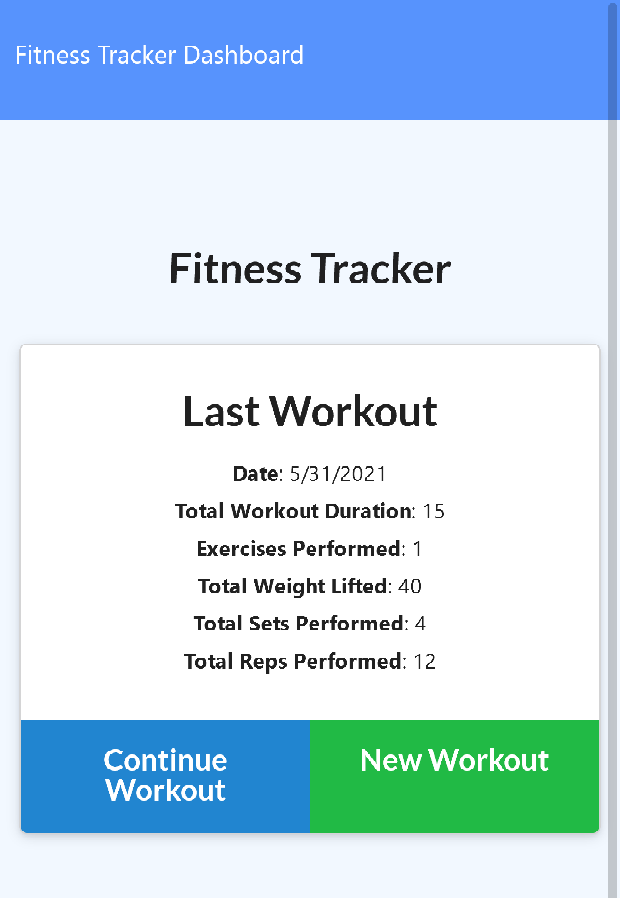

# Workout Tracker

A workout tracker built on MongoDB via mongoose's api. Node > Express > MongoDB 

## Meta

Zachary Eggert – [@eggert_zachary](https://twitter.com/eggert_zachary) – eggert.zachary@gmail.com

Distributed under the GNU GPL v3 license. See ``LICENSE`` for more information.

[https://github.com/ZacharyEggert/Workout-Tracker](https://github.com/ZacharyEggert/)

## Contributing

1. [Fork](<https://github.com/ZacharyEggert/Workout-Tracker/fork>)
2. Create your feature branch
3. Commit your changes
4. Push to the branch
5. Create a new Pull Request
